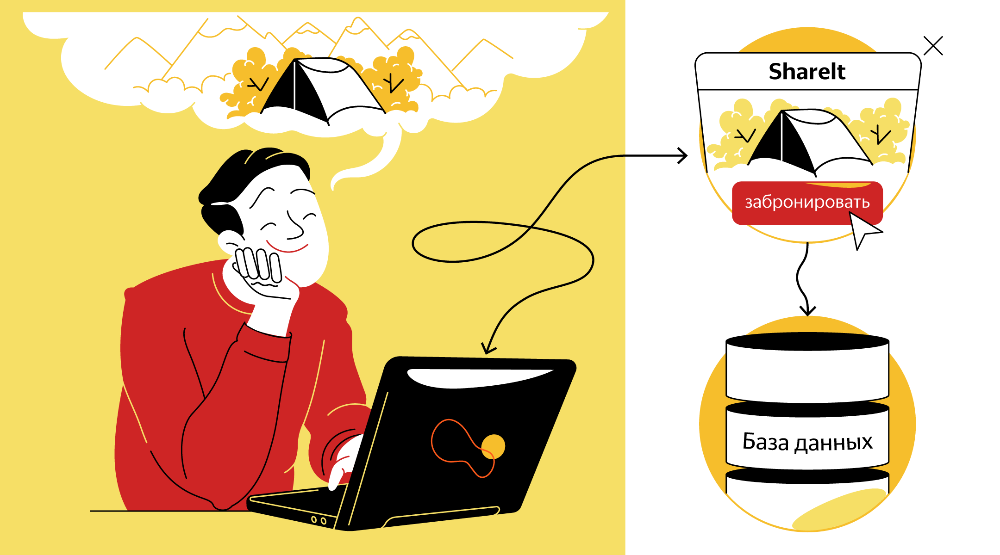
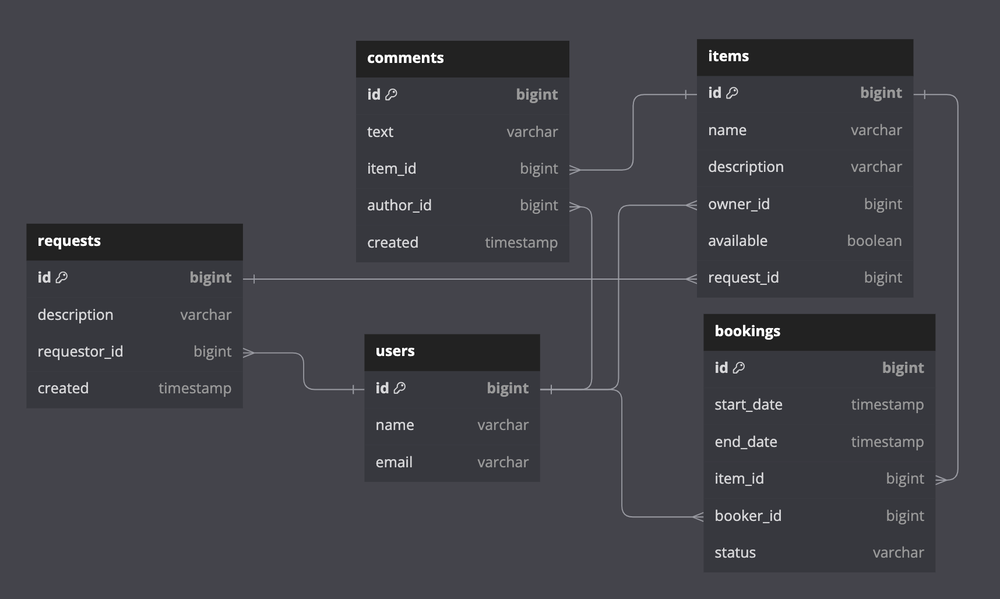

[English](..%2FREADME.md)

# ShareIt

---

*Бэкенд сервиса для предоставления в аренду или шеринга\* какой-либо вещи, инструмента, устройства и т.п. с возможностью бронирования и создания запроса.*

---
Как часто бывает, что столь нужная Вам здесь и сейчас вещь не оказывается под рукой? Проблему можно попытаться решить покупкой новой вещи, ремонтом сломавшейся или 
поиском аналогов у друзей - но это зачастую не всегда подходящие варианты. Насколько было бы удобнее, если бы под рукой был сервис, где пользователи делятся вещами!


 *шеринг - совместное использование и потребление различных вещей и услуг.

---

Это приложение обеспечивает пользователям возможность:

1. Рассказывать, какими вещами они готовы поделиться;
2. Находить нужную вещь и брать её в аренду (или просто так по желанию владельца) на какое-то время;
3. Оставлять запросы на вещь, которая им нужна;
4. Бронировать вещь на определённые даты, при этом закрывать к ней доступ на время бронирования от других желающих;
5. Оставлять запросы на вещь, в случае, если нужной вещи на сервисе нет;
6. По запросу другого пользователя добавлять новые вещи для шеринга;
7. Просмотреть список своих сохраненных в сервисе вещей, а также последнее и следующее бронирование для них;
8. Просмотреть список оформленных ими бронирований на вещи;
9. Просмотреть список бронирований на их вещи с различными вариантами выборки:
  - ALL - все бронирования;
  - CURRENT - текущие бронирования;
  - PAST - прошедшие бронирования;
  - FUTURE - предстоящие бронирования;
  - WAITING - ожидающие ответа;
  - REJECTED - отклоненные бронирования;
10. Оставить комментарий о вещи после использования.
---
Версия Java - 11;

Приложение основано на фреймворке Spring Boot v. 2.7.9;

Система сборки - Apache Maven;

База данных - PostgreSQL;

Обращение к БД и мэппинг сущностей - spring-boot-starter-data-jpa, hibernate;

Тестирование - JUnit, Mockito;

Система контейнеризации - Docker + docker-compose.


Сервис разделен на 2 модуля:

gateway - принимает запросы пользователя, осуществляет предварительную валидацию входных данных, 
направляет корректные запросы на сервер, а затем транслирует ответ. 

server - принимает запросы от gateway, осуществляет логическую валидацию, выполняет CRUD-операции в базе данных.

---

Инструкция по запуску приложения локально:
1. Для запуска приложения необходимо программное обеспечение
- Git (вариант гайда по установке - https://learn.microsoft.com/ru-ru/devops/develop/git/install-and-set-up-git);
- JDK (java SE11+, вариант гайда по установке - https://blog.sf.education/ustanovka-jdk-poshagovaya-instrukciya-dlya-novichkov/);
- Apache Maven (вариант гайда по установке на Windows - https://byanr.com/installation-guides/maven-windows-11/);
- Docker (& docker-compose) - для работы в среде Windows понадобится виртуальная машина с ОС Linux - 
вариант гайда по ее установке - https://learn.microsoft.com/ru-ru/windows/wsl/install.
2. После запуска приложение будет принимать http-запросы в соответствии с API (см. ниже) на порт 8080 (http://localhost:8080/),
убедитесь, что он свободен, в противном случае необходимо будет поменять соответствующие настройки в файлах 
application.properties и docker-compose.yml
3. Запустить терминал/командную строку/PowerShell, выполнить поочерёдно команды, дождавшись завершения каждой:
```
cd {целевая директория для загрузки проекта}

git clone git@github.com:RuslanYapparov/java-shareit.git

cd java-shareit/

mvn package

docker-compose up  

```
4. Для запуска тестового сценария можно воспользоваться коллекцией тестов (см. ниже). Тесты чувствительны к временной зоне -
если Ваша временная зона отличается от UTC+0, то для прохождения некоторых тестов понадобится передать в контейнер модуля server
переменную TZ с Вашей временной зоной.
---

Описание API (OpenAPI):

[shareit-server&gateway-API.json](shareit-server%26gateway-API.json)

для просмотра необходимо скопировать и открыть содержимое в Swagger editor

---

Коллекция тестов Postman:

[shareIt.postman_collection.json](shareIt.postman_collection.json)

импортировать коллекцию, скопировав содержимое в поле как Raw-текст

---

База данных приложения спроектирована в соответствии с ER-диаграммой (облегченная версия, создана с помощью dbdiagram.io):



---


Приложение написано на языке Java. Пример кода:
```java
public class ShareIt {
    public static void main(String[] args) {
        System.out.println("Let's start sharing items!");
    }
}
```